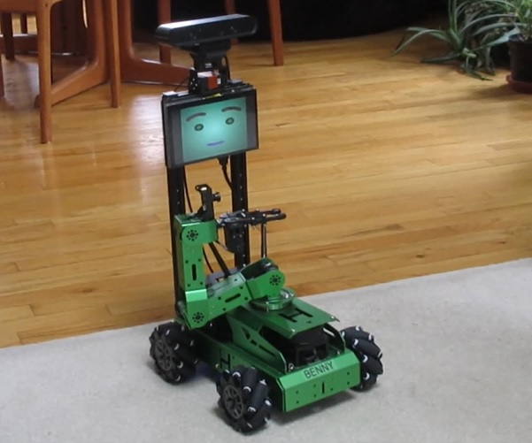

# Wansui
## Mobile Manipulator with Face

Add verbal interaction and symbolic learning to a relatively inexpensive mobile robot with an arm and 3D sensing! This robot is a somewhat modified version of the commercially available [JetAuto Pro](https://www.hiwonder.com/collections/ros-robot/products/jetauto-pro?variant=40040875229271) from Hiwonder and can be assembled for about $1400 (far cheaper than [LoCoBot](https://www.generationrobots.com/en/404057-locobot-autonomous-mobile-robot.html)). The system is based on the [ALIA](https://github.com/jconnell11/ALIA) library and runs with ROS on a Jetson Nano under Ubuntu. It also sports an animated face, as shown in this [video](https://youtu.be/DcIPQSiz_0I).

---

May 2024 - Jonathan Connell - jconnell@alum.mit.edu

