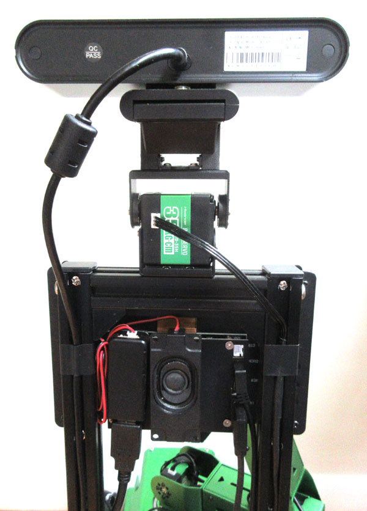

## Hardware Changes

The JetAuto Pro robot needs a number of modification to run with this software. In terms of extra parts you will need:

* Hiwonder HTD-35H servo ($24 from [Hiwonder](https://www.hiwonder.com/products/htd-35h))

* Hiwonder HTD-45H bracket pack ($4 from [Hiwonder](https://www.hiwonder.com/products/htd-45h?variant=39969169473623))

* WaveShare USB soundcard + speakers ($18 from [Amazon](https://www.amazon.com/waveshare-USB-Converter-Speaker-Raspberry/dp/B08RX4DNJ4))

* 1.5 foot USB extender cable ($8 from [Amazon](https://www.amazon.com/gp/product/B077JM5NF5))

* 3 foot right-angle USB cable ($8 from [Amazon](https://www.amazon.com/gp/product/B001AR4NC8))

* 1 foot right-angle HDMI cable ($13 from [Amazon](https://www.amazon.com/gp/product/B0B514ZLRP))

Be aware that the following steps will require drilling several holes and soldering up a new cable. 

### Antennas

The elbow of the arm often swings over the cover of the Jetson Nano. To protect the antennas, unscrew them from the front two holes and re-install them in the back two holes, near the side posts of the arch.

### Neck and Arch

First, use hot melt glue to install a 1/8" spacer underneath the back of the sensor to prevent unwanted tilting. Next remove the chunky plastic adapter from the Orbbec mounting plate then remove the plate itself from the top bar of the rear arch. 

Find the __shorter__ U-shaped servo bracket and drill two centered 3.5mm (1/8") thru-holes 14mm apart. Attach this U-bracket securely to the top bar (instead of the plate) using the original two M3x15 screws. The squared-off end of the servo bracket should be to the left. Now drill two centered 2.5mm (3/32") diameter holes 14mm apart in the longer U-bracket. Using two leftover M2x5 screws (with nuts and lockwashers) connect the bracket to the mounting plate, then reattach the plate to the chunky sensor block.

After this, disassemble the tall rear arch into 3 separate bars. To mount the screen, each side post needs two centered thru-holes drilled using a 4.5mm (11/64") bit: one 5mm from the top and another 105mm from the top. These should match the spacing of outermost mounting holes in backplate of the LCD panel. You might have to trim the black plastic caps on the posts a bit to allow screws to pass through the top holes freely. Finally, 
reassemble the whole arch on the robot.

### Screen and Sound Card

Use the original four M4x20 screws inserted through the new holes you drilled in the side posts to secure the LCD panel __upside-down__ on the front of the arch.  Insert the right-angle end of the HDMI cable into the back of the LCD with the other end going to the Jetson Nano. The new right-angle micro USB cable should be plugged into the "CTouch" jack and can then be routed through the JetAuto body to the auxilliary USB hub underneath the robot. You will likely have to remove the battery retention panel to get at this. 

Next, cut off the wire to one of the two speakers close to the connector. Use Gorilla double-sided tape to affix the remaining speaker to the back plate of the LCD panel. It should be centered with the wires coming out the top. Be sure to leave enough space so your fingers can still use the arch as a handle. Plug the connector into the top of the WaveShare dongle then mount the dongle to the left of the speaker (label side inward). Note that using Velcro instead of Gorilla tape gives somewhat better acoustic isolation. Finally, attach the USB extender cable to the bottom of the dongle and route it to the auxilliary USB hub in the robot's belly.

### Neck Servo

Start by attaching the HTD-35H servo vertically to the short U-bracket on the top bar of the arch using a number of short pointy screws. The servo should be oriented so that the splined shaft is at the top and to the right (connector to the left). Next, also using pointy screws, attach the two black servo discs to the long U-bracket of the Orbbec sensor assembly. The one with the internal teeth for the servo's shaft should go on the right side.

After this, gingerly attach the Orbbec assembly in a fully upright position to the servo, trying not to disturb the zero angle in the process. I find putting on the splined side of the bracket first then "spronging" the other side over the nub on the left works best. Once this is done you can install the two axial screws (silver on left, black on right).

Next, cut the supplied servo cable in half and splice in extra wire to extend its length to about 750mm (29"). Connect one end to the back of the neck servo and route the other end through the robot's body. It should go up and over the shoulder servo then plug into the front of that servo. Temporarily unplug the cable on the top that goes to the rest of the arm servos.

Now boot up the robot, connect using NoMachine, and enter the commands below:

    cd jetauto_ws/src/jetauto_example/scripts/jetauto_adapter_example/serial_servo/
    python3 set_serial_servo_status.py

First, select option 1 and change servo id 1 to 6. Next, put a bubble level on top of the Orbbec sensor and select option 2 to change servo 6's deviation (zero position) and enter a small number. Repeat this with different values until the head is close to level. Don't worry about any errors, simply restart the program when this happens. Finally, exit by choosing option 9. After this you can replug the arm cable into the top of the shoulder servo.

### Battery Pack (optional)

You can extend the run-time of the robot by using a higher capacity battery. I substituted a 5200mah 3S2P pack ($63 from [Tenergy](https://power.tenergy.com/at-tenergy-li-ion-18650-11-1v-5200mah-rechargeable-battery-pack-w-pcb-3s2p-57-72wh-9a-rate)) for the one supplied by Hiwonder (really only about 3000mah). Note that you will have to solder on appropriate connectors yourself: a JST-SM male ($1 from [Digikey](https://www.digikey.com/en/products/detail/sparkfun-electronics/CAB-14574/8543394)) and a 5.5x2.5mm barrel jack ($3 from [Digikey](https://www.digikey.com/en/products/detail/tensility-international-corp/10-01095/3507718)).

---

May 2024 - Jonathan Connell - jconnell@alum.mit.edu

