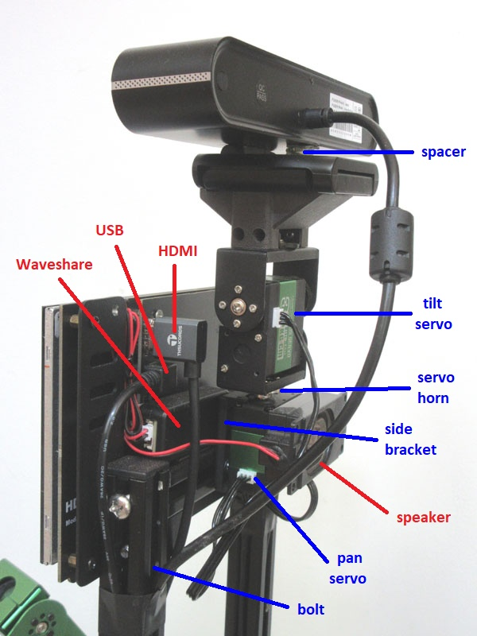

## Hardware Changes

### Hand Camera

The wrist-mounted color camera is not used by this system and actually blocks the view of the repositioned Orbbec range sensor. Therefore, disconnect its cable at both ends (and tuck them away), then unscrew the mounting bracket to permanently remove the camera.

### Lidar

The laser range scanner is also not used and makes quite a racket which interferes with speech recognition! You should unplug its USB cable to prevent rotation and, if you plan to install the optional array microphone (below), remove the whole unit.

### Antennas

The elbow of the arm often swings over the cover of the Jetson Nano. To protect the antennas, unscrew them from the front two holes and re-install them in the back two holes, near the side posts of the arch.

### Side Bracket

Start by taking the Orbbec sensor off the top of the arch. Remove the chunky plastic block at the base of the sensor by undoing the 4 side screws. Then remove the small metal mounting adapter underneath from the top bar. Set these pieces aside for later.

On the short crossbar at the top of the back arch you need to create two new threaded holes. Drill a back-to-front hole exactly in the __center__ of this bar using a #43 bit, then use a tap to thread it for a 4-40 screw. Drill a second hole __20mm__ to the _right_ of the first one and thread it also.

Now find the big flat metal servo bracket and orient it so the longer sides poke upwards at the top and bottom. The curved cutouts should be to the left. Widen the __outermost__ two mounting holes at the bottom with a 1/8" drill. Use two 4-40 x 3/4" screws to attach the plate ("side bracket" in the picture below) to the top bar of the arch using the new threaded holes. Be sure the bracket is oriented exactly orthogonal to the bar before tightening it down.

### LCD Panel

Next, there are two long vertical bars that form the sides of the back arch. On each of these, carefully drill an 11/64" diameter back-to-front thru-hole exactly __37mm__ down from the top end of the bar itself (not from the top of the plastic cap). Use two leftover M4x20 screws ("bolt" in the picture below) to affix the LCD panel to front of the side bars so that it extends upwards significantly past the ends of the bars. 

The panel should have its connectors at the top left when viewed from behind (see below). Install the left-angle HDMI cable at the top, and right-angle USB cable direclty below this. Route the cables down the creases in the side bars and connect them to the ports at the back of the Jetson Nano. A band of electrical tape around the side bar can help keep the cables in place.

### Neck Assembly

Start building upwards from the arch by attaching the HTD-35H __pan servo__ to the newly installed side bracket using 4 small pointed screws. The exposed servo shaft should be on the _left_ side pointed up (centered in the arch). Place the shiny round aluminum servo horn on top of this so that the mounting holes form a square relative to the top bar. Now find a _narrow_ servo bracket and align it with the top bar so that its square end is to the left. Finally, affix this bracket to the servo horn with 4 screws and use an additional central screw to hold the servo horn to the pan servo. This forms the base for the tilt servo.

Next, start building down from the depth sensor. Find a _wide_ servo bracket and drill two centered 1/8" thru-holes __14mm__ apart. Use 1/4" 4-40  screws with nuts and lockwashers to attach this U-bracket to the original small mounting adapter saved from earlier. After this, attach the Orbbec sensor on its plastic block to the mounting adapter using the original 4 side screws. In addition, make sure the hinged plate under the Orbbec is latched closed, then use hot melt glue to install a 1/8" spacer underneath the back of the sensor to prevent unwanted tilting (see picture above).

To complete the assembly, secure the HTD-35H __tilt servo__ in the upwards pointing U-bracket on top of the pan servo using 4 small pointed screws. The exposed shaft should be at the top and pointed to the _right_. Place a splined plastic servo horn on the shaft such that the mounting holes make a vertical cross pattern. Slip a round plastic bearing wheel on the opposite side. Now take the whole Orbbec assembly and slip its U-bracket over this servo. Secure both sides with 4 screws plus a central retaining screw. Assuming the tilt servo is in its neutral position, the head should be level and directly above the servo.

### Sound Card and Speaker

Use [Gorilla](https://www.amazon.com/Gorilla-Heavy-Double-Sided-Mounting/dp/B082TQ3KB5) double-sided tape to affix the one of the small rectangluar speakers to the back of the pan servo __above__ its rear connector jack. It should be flush with the top and right edges of the servo and have its wires coming out to the left (see picture above). Plug the connector into the end of the Waveshare audio dongle then use more Gorilla tape to mount the dongle to the back of the LCD panel, shoved all the way to the lefgt along the top bar of the arch. Attach the male-female USB extender cable to the right side of the dongle and route it along a crease in the right side bar down to a rear USB connector on the Jetson Nano board.

### Servo Wiring

At this point you need to fabricate a new 29" long servo cable. You can cut one of the original cables in half (to preserve the connectors) then splice in some extra 4 conductor cable (e.g. old modular telephone cable). Obviously this will require some __soldering__ and heatshrinking to accomplish. Route the extra long cable from the rear port of the pan servo (under the speaker), through the robot chassis and the back of the arm, all the way to front port of the shoulder servo. As before, the cable can be tucked into one of the creases in the right side bar of the arch to keep things clean. 

Since the pan and tilt servos are new, they must be assigned ID numbers for the software to use them. To do this, temporarily __unplug__ the cable on the top of the shoulder servo that goes to the rest of the arm servos. Now boot up the robot, connect using NoMachine, and enter the commands below:

    cd jetauto_ws/src/jetauto_example/scripts/jetauto_adapter_example/serial_servo/
    python3 set_serial_servo_status.py

First, select option 1 and change servo id 1 to 7 (pan servo). Now, while the program is still running, daisy chain the left port of the pan servo up to the back port of the tilt servo using a standard 4 conductor black cable (see picture). Again select option 1 but this time change servo id 1 to 6 (tilt servo). Don't worry about any errors, simply restart the program when this happens. Finally, exit by choosing option 9. After this you can __replug__ the arm cable into the top of the shoulder servo.

### Battery Pack (optional)

You can extend the run-time of the robot by using a higher capacity battery. I substituted a 5200mah pack for the one supplied by Hiwonder (really only about 3000mah). You will have to solder on appropriate connectors yourself: a JST-SM male to connect to the robot, and a 5.5x2.5mm barrel jack for the charger input. Note you will likely have to __swap__ the red and black wires on the JST stock connector to make it match the one from Hiwonder! When done, remove the robot's belly plate and affix the new battery to the plate using Gorilla tape.

### Array Mic (optional)

Remove the original lidar unit and insert the ReSpeaker puck into this front cavity. The mic disc should be flush with the start of the front bevel, and oriented so its USB cable comes off to the __northwest__ (as viewed from the front). Secure the unit to the lower chassis with double-sided Gorilla tape. Finally, thread its cable through the chassis and connect it to the internal USB hub near the battery.

---

May 2026 - Jonathan Connell - jconnell@alum.mit.edu

