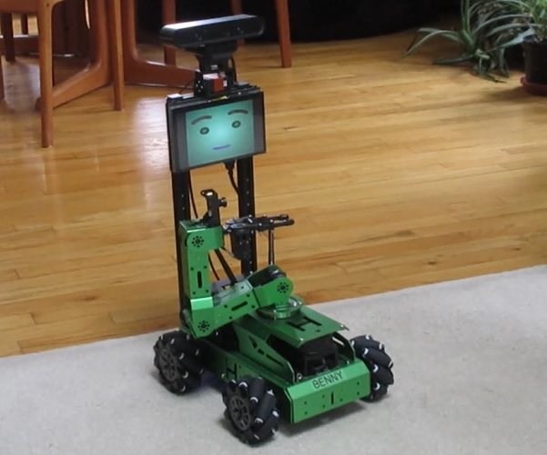

# Wansui
## Mobile Manipulator with Face

Add verbal interaction and symbolic learning to a relatively inexpensive mobile robot with an arm and 3D sensing! This robot is a somewhat modified version of the commercially available __JetAuto Pro__ from [Hiwonder](https://www.hiwonder.com) and can be assembled for under $1400 (much cheaper than [LoCoBot](https://robotshopshop-dev.myshopify.com/products/locobot-px100)). The system is based on the [ALIA](https://github.com/jconnell11/ALIA) cognitive library and runs with ROS on a Jetson Nano under Ubuntu. It also sports an animated [face](https://github.com/jconnell11/hmore_face), as shown in this [__video__](https://youtu.be/DcIPQSiz_0I).

### Overview

After assembling the basic robot, there are a number of hardware modifications required. These include moving the screen, adding neck servos, and the installation of a sound card. There are also a number of software changes and calibration steps that should be performed. 

1. [Parts List](parts_list.md)
2. [Hardware Modifications](hardware.md)
3. [Software Configuration](software.md)
4. [Credentials & Calibration](calibration.md)

Be aware that there are some holes to be drilled and an extension cable that needs to be soldered.

### Operation

When all the modifications are complete, you should be able to invoke the demo by a short press of the _centermost_ __button__ near the back right corner of the circuitboard. Use a short press of the other, right button near the edge of the board to exit. A long press of the centermost will cleanly shut down the robot, but you must still power it off manually (after the blue screen). 

You can __talk__ to the robot to get it to move (e.g. "turn right" or "gaze up" or "extend the arm") It can also navigate around its environment, find and grab small objects, and perform all the sorts of learning shown in this [__video__](https://youtu.be/EjzdjWy3SKM). Note, you will need to say "robot" or the network name of the machine (e.g. "Benny") to get the robot's attention (eyes turn light blue). 

You can also __type__ to the robot if you prefer that to speaking. The easiest way is to connect via NoMachine and type the command "demo" (or alternatively "cd ~/Wansui" then "roslaunch wansui_vis wansui_vis.launch"). You will have to resurface the command window (e.g. Alt-Tab) on top of the face in order to type. If you instead started the robot using the button, you can use the command "connect" (e.g. from a remote SSH session). No attention word is necessary when typing.

For an even cheaper (and cuter) version see [Ganbei](https://github.com/jconnell11/Ganbei).

---

May 2026 - Jonathan Connell - jconnell@alum.mit.edu

